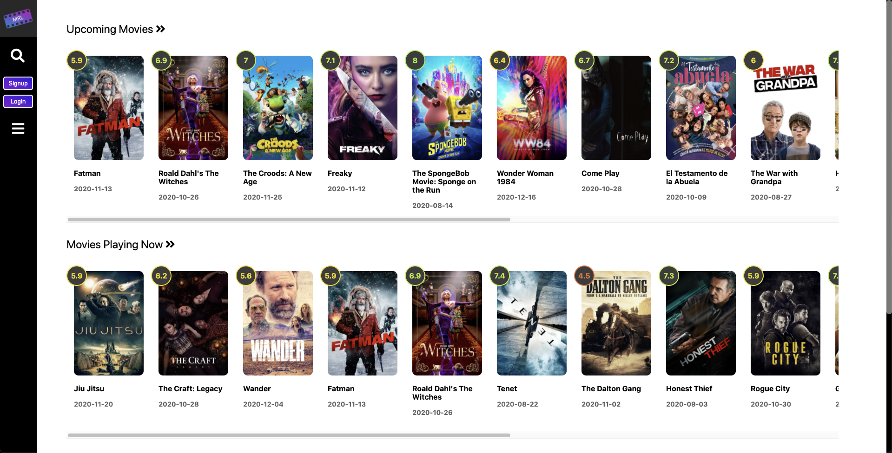
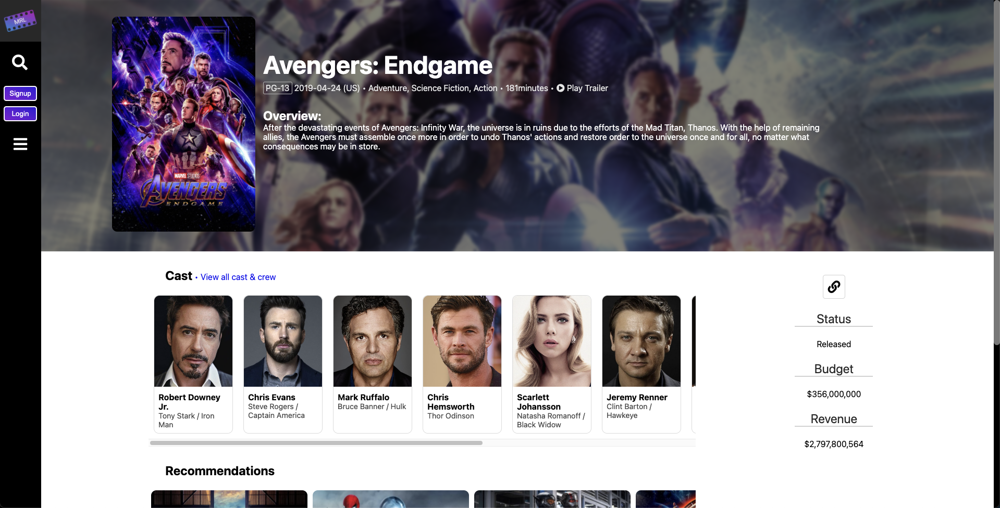

<p align="center">
  <a href="https://github.com/lukeaelder/Capstone1">
    
  </a>
  <h2 align="center">MovieR&L</h2>
  <p align="center">
    A website where users can view movie information, create movie list, favorite and watchlist movies, and leave reviews.
    <br />
    <a href="https://github.com/othneildrew/Best-README-Template">View Heroku Demo</a>
  </p>
</p>

  

## About the project

This project was created as the Capstone 1 project for the [Springboard](https://www.springboard.com/) software engineering course. This project gets all of its movie data from [The Movie Database API](https://developers.themoviedb.org/3).

User features include
* Searching for movies by title.
* Viewing upcoming, top rated, popular, and now playing movies.
* Get information on a movie such as genres, budget, actors, recommendations, and more.
* Watch the trailer for a movie.
* Create and login to accounts with password hashing.
* Edit account information.
* Leave reviews on movies.
* Add a movie to the users favorites and watchlist.
* Create lists of movies.
* Viewing all of the lists created by other users.

## Built with

* Python
* HTML
* CSS
* Javascript
* [The Movie Database API](https://developers.themoviedb.org/3)
* [JQuery](https://jquery.com)
* [Axios](https://www.npmjs.com/package/axios)
* [Jinja](https://jinja.palletsprojects.com/en/2.11.x/)
* [Flask](https://flask.palletsprojects.com/en/1.1.x/)
* [Postgres](https://www.postgresql.org/)
* [SQL Alchemy](https://flask-sqlalchemy.palletsprojects.com/en/2.x/)
* [Flask-Bcrypt](https://flask-bcrypt.readthedocs.io/en/latest/)
* [WTForms](https://wtforms.readthedocs.io/en/2.3.x/)
* [Font Awesome](https://fontawesome.com/)
* [Balloon.css](https://kazzkiq.github.io/balloon.css/)
* [Muuri](https://muuri.dev/)
* [Web Animations](https://developer.mozilla.org/en-US/docs/Web/API/Web_Animations_API)
* [HammerJS](https://hammerjs.github.io/)

## Run a local version

1. You will need an API key from [The Movie Database API](https://developers.themoviedb.org/3) to run a local version.
2. Clone the repo.
 ```sh
git clone https://github.com/lukeaelder/Capstone1.git
```
3. Create a [virtual environment](https://docs.python.org/3/library/venv.html) in the directory (optional).
4. Install the requirements.
```sh
pip install -r requirements.txt
```
5. Create a database using [Postgres](https://www.postgresql.org/).
```sh
createdb capstone1
```
6. Create tables in database in python.
```python
db.create_all()
db.session.commit()
```
7. Create a new file named secrets.py and include the following.
```python
secret_key = "(whatever you would like the SECRET_KEY to be)"
api_key = "?api_key=(your TMDB API key)"
api_base = "http://api.themoviedb.org/3/"
```
8. Start flask server and go to [localhost:5000](http://localhost:5000)
```sh
flask run
```